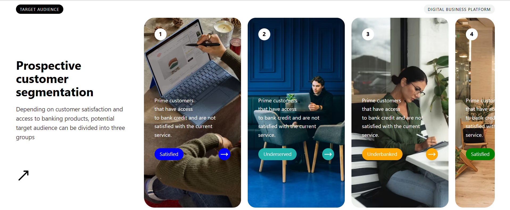
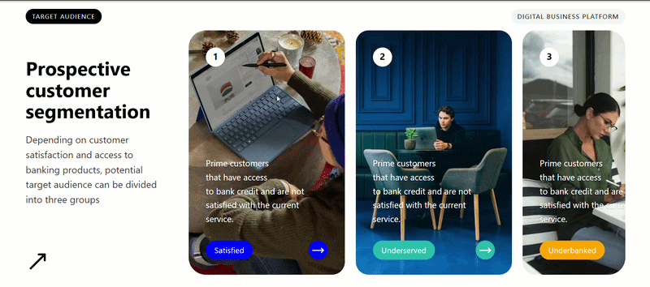
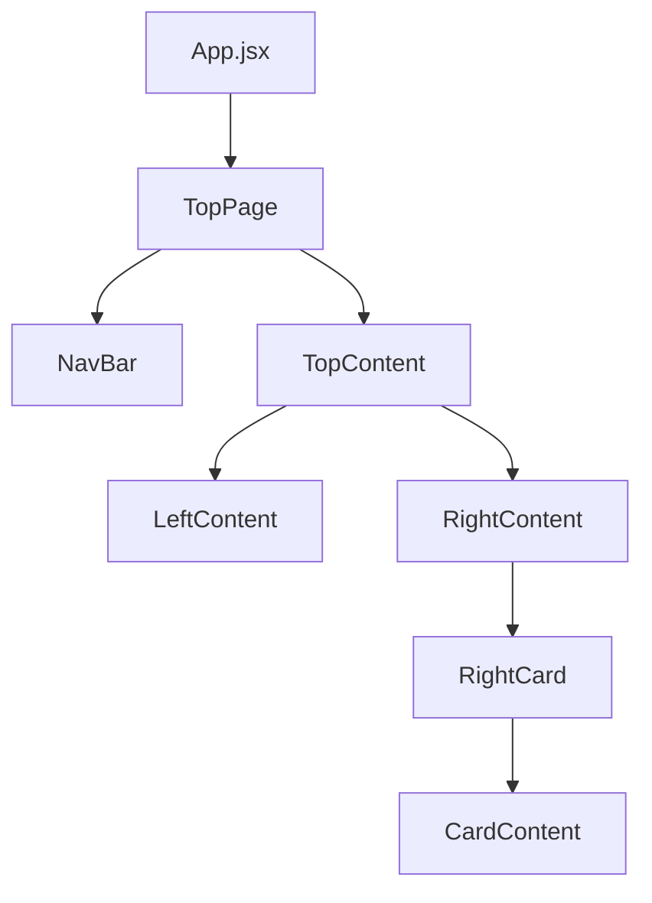

# React Tailwind UI

A responsive customer segmentation interface built with React and Tailwind CSS. The layout presents customer groups through image-based cards with dynamic labels, colors, and reusable components.

## Table of Contents

- [Preview with Live Demo](#preview-with-live-demo)
- [Features](#features)
- [Implementation](#implementation)
- [Tech Stack](#tech-stack)
- [Project Structure](#project-structure)
- [Component Flow](#component-flow)
- [Getting Started](#getting-started)
- [Author](#author)

## Preview with Live Demo

Click the preview to visit the live page 👇

[](https://github.com/hadiashah01/react-tailwind-ui/)

### Horizontal Scroll



## Features

- Customer segmentation card interface
- Responsive two-section layout
- Horizontally scrollable card section
- Reusable React components
- Dynamic customer data rendering
- Image-based card backgrounds
- Dynamic labels and colors
- Custom scrollbar handling
- Lucide React icons

## Implementation

- The customer data is maintained in an array inside `App.jsx` and passed to the `TopPage` component through **props**.

- The data is then passed through the component hierarchy until it reaches the card components. `map()` is used to dynamically generate each customer card instead of creating the cards individually.

- The interface is divided into reusable components for the navigation, left content, card section, individual cards, and card content.

- Tailwind CSS utility classes are used throughout the components for layout, spacing, typography, sizing, positioning, backgrounds, and responsive styling.

- The right-side cards use horizontally scrollable content, while the scrollbar is hidden to maintain a cleaner visual presentation.

### Data Flow

```text
App
 ↓
TopPage
 ↓
TopContent
 ├── LeftContent
 └── RightContent
      ↓
   RightCard
      ↓
   CardContent
```

## Tech Stack

- React
- Vite
- JavaScript
- Tailwind CSS
- Lucide React

## Project Structure

```text id="q6v2y4"
react-tailwind-ui/
├── public/
│   └── preview.png
└──  src/
   ├── components/
   │   └── TopPage/
   │       ├── CardContent.jsx
   │       ├── LeftContent.jsx
   │       ├── NavBar.jsx
   │       ├── RightCard.jsx
   │       ├── RightContent.jsx
   │       ├── TopContent.jsx
   │       └── TopPage.jsx
   ├── App.jsx
   ├── index.css
   └── main.jsx

```

## Component Flow



## Getting Started

### Clone the repository

```bash id="q2sp4p"
git clone https://github.com/hadiashah01/react-tailwind-ui.git
cd react-tailwind-ui
```

### Install dependencies

```bash id="y7a8kx"
npm install
```

### Run locally

```bash id="c6k8m1"
npm run dev
```

## Author

**Hadia Shahjahan**

- GitHub: [@hadiashah01](https://github.com/hadiashah01)
- LinkedIn: [Hadia Shahjahan](https://linkedin.com/in/hadia-shahjahan)
